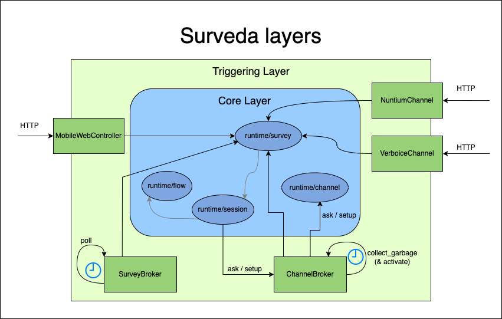

# Surveda Layers and Respondent Locks

Read [this PR](https://github.com/instedd/surveda/pull/1667) for further information

## Surveda layers

* `runtime/survey_broker.ex` -> Module that uses `GenServer`. Actions that must be triggered by time passing live here. Iterates once a minute and is the responsible for polling running surveys, retrying respondents and so. Surveda is being “proactive"
* `runtime/survey.ex` -> Is just a simple elixir module that has the logic of knowing how to handle the next step of the survey and updating the respondent (among a few other tiny things)
* `runtime/channel_broker.ex` -> Module that uses `GenServer`. Responsible of managing calls to runtime channels to avoid overloading them. [See channel broker wiki](https://github.com/instedd/surveda/wiki/Channel-Broker) for more details
* `runtime/*_channel.ex` -> Modules responsible of the know-how to interact with the real channels. All outgoing and incoming interactions with the channels go through these.

## Respondent locks

All the components at the _TriggeringLayer_ are responsible of locking the action per-respondent and all the functions in _CoreLayer_ know nothing about locks.

The main reason for taking this decision was that [Mutex](https://hexdocs.pm/mutex/readme.html) it's not a reentrant Mutex. So, deadlocks can occur if a respondent is locked more than once in the same process.

Below the places where the respondent locks are done

### Survey Broker

Every time the survey broker is being proactive

* `retry_respondents`
* `start_some`

See [this commit](https://github.com/instedd/surveda/pull/1667/commits/39f67f1584a137bd9b1ac4efa9def11e4d690015) for further details

### Verboice channel

Every time Surveda receives a callback from Verboice

* `callback`: both status and respondent digits

See [this commit](https://github.com/instedd/surveda/pull/1667/commits/ebd136cdeec1c79eeecd61809f5f3d971c2bd895) for further details

### Nuntium channel

* `callback`: both status and respondent responses

Every time Surveda receives a callback from Nuntium

See [this commit](https://github.com/instedd/surveda/pull/1667/commits/4834803363dc7173f02d16f7b20ea0a6f4204ec3) for further details

### Mobile survey controller

Every time a respondent interacts with Surveda

* `sync_step`

See [this commit](https://github.com/instedd/surveda/pull/1667/commits/d2f3aa59f3fe21b869009c72bb369a4775b7b133) for further details

### ChannelBroker

Every time the ChannelBroker unqueues a respondent and activates their contact

* `activate_next_queued_contact`
