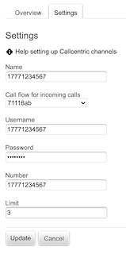
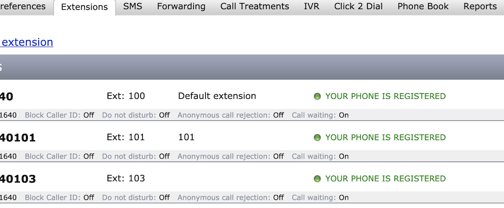
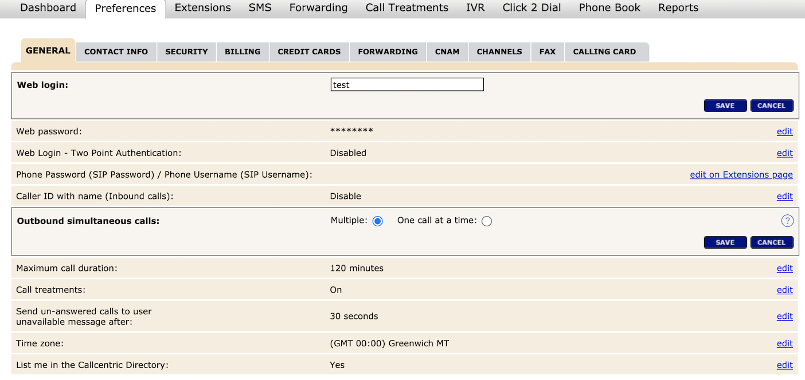

## Simultaneous calls

Let's use "Callcentric" to emulate simultaneous calls.
Each phone number in "Callcentric" has a default extension and other extensions can be added to the same phone number.
In this case, the default extension will be used as the "Verboice" channel to make calls and other extensions added will be used as "respondents".
Make sure that the "Verboice" channel has a limit greater than 2. This configuration is located in the channel settings (https://verboice.instedd.org/channels/channel_id/edit).

The extensions (i.e. 101) are added to the phone number here: https://my.callcentric.com/extensions.php.

In the “Callcentric” preferences (https://my.callcentric.com/preferences.php), the variable “Outbound simultaneous calls:” must have the value “Multiple” selected.

After adding each extension we must register them in our softphone.
Then when we send a survey to a sample that contains the extensions that we have added, we will receive the survey simultaneously from each extension on our phone.
