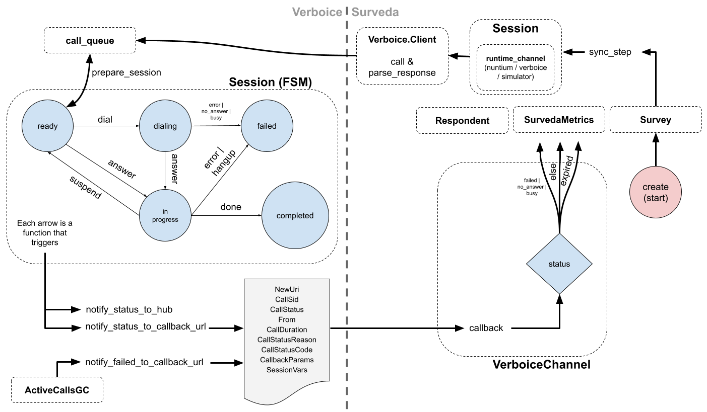

# Calls and callbacks to verboice channels

In this document we will explore the life cicle of calls from Survey creation in Surveda to Verboice and back. 

Here is a diagram of this life cicle:

(and it can be modified [here](https://docs.google.com/drawings/d/1LWg4JYsH-5TuguiedPMD0M6x-b97KvwBeeesr_wmEyo/edit?usp=sharing))

A Survey is created, and when it starts running or it has to move forward the function `sync_step` is called. It will recover the `runtime_channel` of the running `session` to make contact with the respondents through the channels associated with the survey. The `runtime_channel` could be a `VerboiceChannel`, a `NuntiumChannel`, etc. In this document, we will see the life cycle through Verboice.
 
The `verboice_channel` will use the `Verboice_Client` module, specifically its `call` method to pass to Verboice all the data that is needed for the call to be queued there. 
 
In Verboice’s `session` when all is ready and the `prepare_session` method is called, a `queued_call` is taken from the call queue and it will go through the states of this finite state machine. 
 
As is pointed out in the diagram, each change in the session state will be notified to the `callback_url`. In the case that we are exploring, this will be a surveda URL to notify the status changes. Also, for each call, there is a `call_log` that saves things as the actual state, the mentioned `callback_url` among others (`js_context`, `duration`, etc.). 
 
Alternatively, for calls that have been active for too long, there is an `active_calls_gc` (garbage collector). The use case for this module is that active calls in this active state for a too long time actually lost their session and they have to be marked as failed in an external module. For them, the `notify_failed_to_callback_url` will trigger a callback informing Surveda that the call has failed. Also, the `call_logs` in Verboice will be modified accordingly to mark these calls as failed. 
 
When a callback is received in Surveda, it is processed by its channel (i.e. `VerboiceChannel`/`NuntiumChannel`) to act accordingly: update the `Respondent`’s state, modify the `SurvedaMetrics` statistics, and move a step forward the `Survey` where this call belongs to. 
 
And the cycle restarts :) 
 
